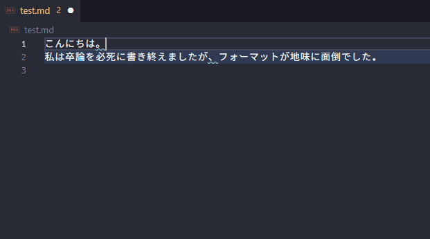

# soturonlinter README

## Features

「区切り文字は『、。』ではなく『，．』にしてください。」というフォーマットで修正し忘れるということ、ありますよね。
「そういったルールを備えたlinter、どこ？」という課題を解決しました。
個人的にミスが多かったものを他にも追加して、最強の卒論執筆環境を整えたいと思います。

## Extension Settings

## Known Issues

## Release Notes

### 0.0.1

とりあえず「、。」を警告する機能だけ盛り込んだ。
